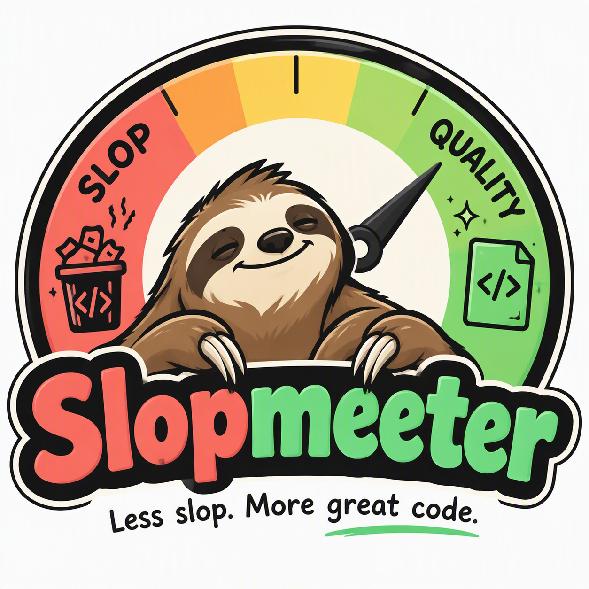
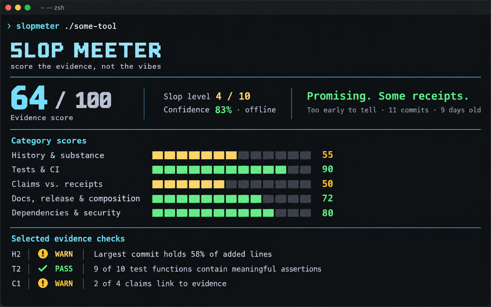

# Slop Meeter

<p align="center">
  
</p>

<p align="center">
  <a href="LICENSE"><picture><source media="(prefers-color-scheme: dark)" srcset="https://shieldcn.dev/github/license/rgilsimoes/slopmeeter.svg?variant=outline&amp;mode=dark"></picture></a>
  <a href="https://github.com/rgilsimoes/slopmeeter/actions/workflows/ci.yml"><picture><source media="(prefers-color-scheme: dark)" srcset="https://shieldcn.dev/github/ci/rgilsimoes/slopmeeter.svg?workflow=ci.yml&amp;branch=main&amp;variant=outline&amp;mode=dark"></picture></a>
  <a href="https://github.com/rgilsimoes/slopmeeter/tags"><picture><source media="(prefers-color-scheme: dark)" srcset="https://shieldcn.dev/github/tag/rgilsimoes/slopmeeter.svg?variant=outline&amp;mode=dark"></picture></a>
  <a href="pyproject.toml"><picture><source media="(prefers-color-scheme: dark)" srcset="https://shieldcn.dev/badge/python-3.11%2B-blue.svg?variant=outline&amp;mode=dark&amp;logo=python"></picture></a>
  <a href="pyproject.toml"><picture><source media="(prefers-color-scheme: dark)" srcset="https://shieldcn.dev/badge/runtime_deps-0-brightgreen.svg?variant=outline&amp;mode=dark"></picture></a>
</p>

**Score the evidence, not the vibes.** Slop Meeter is a local command-line tool that asks whether a
software repository has receipts for what it claims: meaningful history, tests that assert things,
reproducible claims, release hygiene, plausible attention, and signs of active maintenance.

It does not detect AI-written code, judge taste, or declare projects fraudulent. It reports static,
explainable signals so you can decide whether a repository deserves more of your attention.

[Latest CI self-score](docs/SELF_SCORE.md) — regenerated on every default-branch push. The young-repo
warning is kept on purpose; honesty is the brand.

## Install

Slop Meeter requires Python 3.11 or newer. The PyPI distribution is named `slop-meeter` because the
unhyphenated name was already occupied.

```sh
pipx install slop-meeter
```

Alternatively, install the command with [uv](https://docs.astral.sh/uv/):

```sh
uv tool install slop-meeter
```

For a source checkout:

```sh
pipx install .
slopmeter /path/to/another/repository
```

The equivalent source installation with uv is:

```sh
uv tool install .
slopmeter /path/to/another/repository
```

Runtime analysis uses only the Python standard library. Development uses pytest and Ruff.

## Usage

```text
slopmeter <path-or-url> [options]

  --online                    enable registry and GitHub API checks
  --token TOKEN               GitHub token; defaults to GITHUB_TOKEN
  --deep-stars                bounded stargazer-account sampling; requires --online
  --format text|json|markdown|html
                              output format (default: text)
  --color auto|always|never  colourise text output (default: auto)
  -o, --output FILE          write the report to FILE
  --fail-under N              exit 1 when the evidence score is below N
  --max-commits N             history cap (default: 5000)
  --config FILE               TOML weight, threshold, ignore and buzzword overrides
  --explain CHECK_ID          explain one check and its rationale
  --list-checks               list every check
  --version                   show the installed version
```

Local paths are inspected in place and never executed. HTTPS GitHub URLs are cloned into a temporary
directory and removed afterward; because cloning is network access, URL targets require `--online`.

```sh
slopmeter .
slopmeter ../interesting-tool --format json --fail-under 60
slopmeter https://github.com/owner/project --online --format markdown
slopmeter . --format html --output slopmeter-report.html
slopmeter --explain C1
```

Exit status is `0` for a completed run, `1` when `--fail-under` is not met, and `2` for usage or runtime
errors. Tokens and detected secret values are never printed.

While an analysis is running in an interactive terminal, Slop Meeter shows a spinner with rotating
status messages such as “Deslopifying” and “Unsloptastic”. The indicator is written to stderr and
automatically disabled for pipes and redirected output, so reports remain machine-readable.

## Reports

Interactive text output uses colour when stdout is a compatible terminal. `--color always` forces
ANSI colour, while `--color never` disables it. The default `auto` mode emits plain text when output is
piped, redirected, written with `--output`, `NO_COLOR` is present, or `TERM=dumb`. JSON, Markdown, and
HTML never receive ANSI sequences.



The HTML format is a single responsive and printable file with no JavaScript, remote assets, tracking,
or network requests. Repository-provided text is escaped and evidence paths are displayed as text
rather than converted into local links.


`--output` is available for every format and replaces its destination only after rendering and writing
complete successfully. Without it, reports continue to be written to stdout.

## Text sample

```text
SLOP MEETER v0.2.0
score the evidence, not the vibes
target  ./some-tool
────────────────────────────────────────────────────────────────────────────────────────────────
EVIDENCE SCORE  64 / 100            SLOP LEVEL  4 / 10        CONFIDENCE  83% · offline
VERDICT         Promising. Some receipts.
MATURITY        Too early to tell: 11 commits, 9 days old

CATEGORY SCORES
History & substance              ██████░░░░   55
Tests & CI                       █████████░   90
Claims vs. receipts              █████░░░░░   50

EVIDENCE CHECKS

History & substance
  H2  ! WARN largest commit holds 58% of added lines

Tests & CI
  T2  ✓ PASS 9 of 10 test functions contain meaningful assertions
```

Every result carries short evidence such as paths, line numbers, commit hashes, and counts. All report
formats are deterministic for an injected analysis time. JSON is documented by
[`docs/REPORT_SCHEMA.json`](docs/REPORT_SCHEMA.json).

## Configuration

Pass a TOML file with `--config`:

```toml
ignored_paths = [".git", "node_modules", "vendor", "generated"]
buzzwords = ["agentic", "revolutionary"]
max_file_size = 1000000
max_files = 20000

[weights]
C1 = 5
H4 = 0

[thresholds.H1]
pass_commits = 40
warn_commits = 12
```

Threshold keys follow the IDs documented in [the methodology](docs/METHODOLOGY.md). A zero check weight
makes that check informational for scoring.

## Safety model

Target repositories are untrusted input. Slop Meeter never imports target modules or runs their tests,
installers, hooks, scripts, or quickstarts. Python tests are parsed with `ast`; other source is read as
text. Symlinks are not followed, binary and oversized files are skipped, file and request counts are
capped, Git subprocesses have timeouts, and clones disable hooks, submodules, global Git configuration,
and known smudge filters. Network requests occur only with `--online`.

## Method and limitations

The complete rubric, weights, thresholds, and rationale live in
[`docs/METHODOLOGY.md`](docs/METHODOLOGY.md). The short version: this is a set of review prompts, not a
verdict on authors.

- Heuristics are gameable; independent usage and reproducibility are difficult to measure offline.
- Claim extraction is regex-based and can produce false positives or negatives.
- Assertion analysis is strongest for Python, best-effort for JavaScript and TypeScript, and unavailable
  for other languages.
- Young repositories cannot have deep history, so the score is shown with “Too early to tell” rather
  than quietly pretending maturity.
- Registry existence does not prove a dependency is safe, and secret scanning intentionally favors
  high-confidence patterns over broad coverage.
- GitHub attention signals can be incomplete because API sampling and request counts are capped.

## Development

```sh
python -m venv .venv
.venv/bin/pip install -e '.[dev]'
.venv/bin/ruff check .
.venv/bin/pytest
```

Or let uv create and manage the development environment:

```sh
uv sync --extra dev
uv run ruff check .
uv run pytest
uv run slopmeter .
```

Calibration data is deliberately owner-curated. Copy `calibration/labels.example.csv`, add reviewed
repositories, then run `python calibration/calibrate.py labels.csv --online`. Do not infer labels from
stars, popularity, or this tool's own output.

Licensed under the MIT License.
